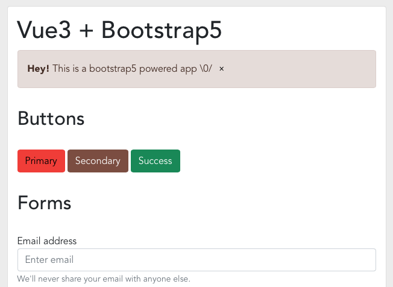

# Vue3 with Vanilla Bootstrap5

Fork this repo, run `npm i` to install dependencies and `npm run serve` to start server.
Then navigate to [http://localhost:8080/](http://localhost:8080/).



## (Re)Start from scratch

Install Vue3 (globally, if not already done). Create the project and add dependencies :

```
$ npm install -g @vue/cli
$ vue create vue3-with-vanilla-bootstrap5
$ npm i bootstrap@next popper.js
$ npm i sass-loader sass
```

It seems Popper is a mandatory dependency with BS5.

### Bootstrap 5

[Other people](https://designmodo.com/bootstrap-5/) have already written nice articles about this ;-)

### Customize bootstrap

See `src/assets/custom.scss`.

### Import boostrap (style+js)

In `main.ts`

```ts
// bootstrap javascript
import 'bootstrap'

// bootstrap style
//import 'bootstrap/scss/bootstrap.scss'
import '@/assets/custom.scss'
```

In Vue component, import only the types you need (Modal, Popover, ...) :

```html
<template>
  <!-- ... -->
  <button type="button" class="btn btn-dark" @click="showModal()">Show modal</button>
  <!-- ... -->
  <div ref="modalRef" class="modal" tabindex="-1" role="dialog">
    <div class="modal-dialog" role="document">
      <!-- ... -->
    </div>
  </div>
  <!-- ... -->
</template>
```

```ts

import { ref } from 'vue'
import { Modal } from 'bootstrap'

export default {
	// ...
	setup() {

		const modalRef = ref(null);

		const showModal = () => {
			const dialog = new Modal(modalRef.value, { backdrop: true });
			dialog.show();
		};

		return { modalRef, showModal };
	}
}
```
